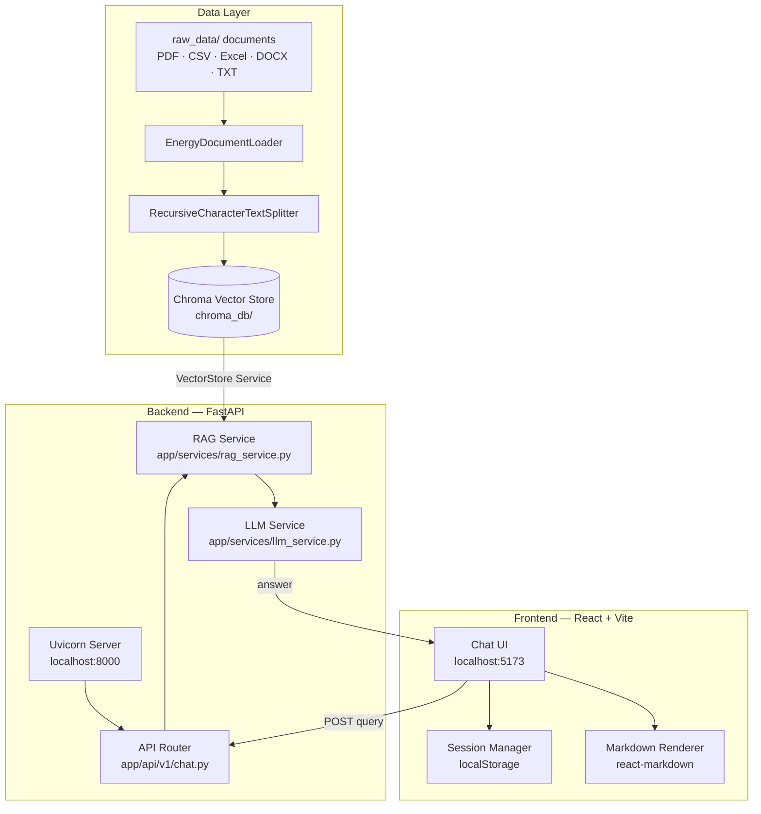

# Energy Market Knowledge Assistant

A full-stack Retrieval-Augmented Generation (RAG) application for querying energy market knowledge.

The backend loads raw energy market documents, builds a vector store (e.g. Chroma), performs semantic retrieval, and calls a LLM (e.g. Gemini) to answer user queries using only retrieved context. The frontend provides a modern, polished chat interface with multi-session history, Markdown rendering, and dark/light mode.

---

## Architecture



### Request flow

1. User types a query in the React UI and hits Send.
2. The frontend `POST`s `{ "query": "..." }` to `/api/v1/chat`.
3. `app/api/v1/chat.py` validates the request using Pydantic models in `app/models/schemas.py`.
4. `app/services/rag_service.py` retrieves context via `app/services/vector_store.py`.
5. The top documents are formatted into a prompt and sent to the Gemini model.
6. The answer is returned and rendered as Markdown in the UI.

---

## Project Features

### Backend
- **FastAPI** service with request validation and CORS support.
- **Multi-format document ingestion** — PDF, CSV, Excel, DOCX, and TXT.
- **Automatic file watcher** — monitors `raw_data/` and rebuilds the vector store when new documents are added.
- **Vector search** — Chroma + FastEmbed embeddings for semantic similarity retrieval.
- **RAG prompt construction** — enforces answers from retrieved context only.
- **Gemini LLM** integration via `langchain-google-genai` (`gemini-2.5-flash-lite`).
- **Dockerized** — runs as a container with mounted volumes for `chroma_db/` and `raw_data/`.

### Frontend
- **Modern, professional chat UI** with an optional light mode toggle persisted in `localStorage`.
- **Markdown rendering** — `react-markdown` renders bold, italic, lists, code blocks, headings, and blockquotes from LLM responses.
- **Multi-session history** — every page load starts a new session; past sessions persist in `localStorage`.
- **Date-grouped sidebar** — sessions organised under *Today / Yesterday / Previous 7 Days / Previous 30 Days*.
- **Resume any session** — click a past session in the sidebar to continue its conversation.
- **Auto-titled sessions** — title set from the first 52 characters of the first user message.
- **⋯ options menu** — hover a session to reveal the options button; click for **Rename** (inline edit, `Enter`/`Esc`) or **Delete**. Right-click opens the same menu.
- **Typing indicator** and clickable suggestion cards on the empty state.

---

## Project Structure

```
Energy Market Knowledge Assistant/
│
├── main.py                 # Root wrapper (imports app.main:app)
├── app/                    # Modular Backend Package
│   ├── main.py             # FastAPI app initialization & lifespan
│   ├── api/                # API route definitions
│   │   └── v1/chat.py
│   ├── core/               # App configuration & background services
│   │   ├── config.py
│   │   └── watcher.py
│   ├── data/               # Data Storage Package
│   │   ├── raw_data/       # Source documents (PDF, CSV, etc.)
│   │   └── chroma_db/      # Persisted vector database
│   ├── models/             # Pydantic data models
│   │   └── schemas.py
│   └── services/           # Business logic & external integrations
│       ├── document_loader.py  # Multi-format strategies
│       ├── vector_store.py     # DB-agnostic interface
│       ├── llm_service.py      # LLM provider-agnostic interface
│       ├── embedding_service.py # Embedding provider-agnostic interface
│       └── rag_service.py      # Core RAG orchestration
│
├── pyproject.toml          # Python dependencies
├── Dockerfile              # Container definition
└── frontend/               # React + TypeScript + Vite UI
```

---

## Backend Components

### `app/main.py`
- App entry point and `lifespan` manager.
- Initializes the file watcher and handles initial vector store checks.

### `app/services/`
- **`document_loader.py`**: Uses a Strategy pattern to load various file formats.
- **`vector_store.py`**: Provides an abstract interface (defaulting to ChromaDB).
- **`llm_service.py`**: Abstraction for LLM providers (defaulting to Google Gemini).
- **`embedding_service.py`**: Abstraction for embedding models (defaulting to FastEmbed).
- **`rag_service.py`**: Orchestrates retrieval and LLM generation via the modular services.

### `app/core/`
- **`config.py`**: Centralized settings using environment variables.
- **`watcher.py`**: Background thread monitoring `raw_data/` for changes.

### `app/api/`
- Modular routing using FastAPI's `APIRouter`. Endpoint: `/api/v1/chat`.

---

## Frontend Components

### `src/App.tsx`
| Concern | Implementation |
|---|---|
| Session state | `useState<Session[]>` — each session holds `id`, `title`, `messages[]`, `createdAt`, `updatedAt` |
| Persistence | `localStorage` under key `energy_rag_sessions` (only sessions with ≥1 message are saved) |
| Theme | `useState<'dark'\|'light'>` applied via `data-theme` on `<html>`; saved to `localStorage` |
| Context menu | `useState<CtxMenu \| null>` — positioned at click coordinates; closed on outside click |
| Rename | Inline `<input>` replaces the session title span; confirmed on `Enter` or blur |
| Markdown | `<ReactMarkdown>` wraps all assistant message content |

### `src/index.css`
- CSS custom properties for both `[data-theme="dark"]` and `[data-theme="light"]`.
- Full prose styles for Markdown output (headings, lists, code, blockquotes).
- Context menu, rename input, typing indicator, and suggestion card styles.

---

## Environment Variables

| Variable | Used by | Default | Purpose |
|---|---|---|---|
| `GOOGLE_API_KEY` | Backend | — | Required to call Google Gemini |
| `VECTOR_STORE_TYPE` | Backend | `chroma` | `chroma` (milvus support ready) |
| `LLM_PROVIDER` | Backend | `google` | `google` (openai/anthropic support ready) |
| `EMBEDDING_PROVIDER` | Backend | `fastembed` | `fastembed` (huggingface support ready) |
| `VITE_API_URL` | Frontend | `http://localhost:8000` | Backend base URL |

Create a `.env` file in the project root (see `.env.example`):

```env
GOOGLE_API_KEY=your_google_api_key_here
```

---

## Running with Docker (recommended)

### Requirements
- Docker Desktop installed and running.
- `.env` file with `GOOGLE_API_KEY` set.

### Start the full stack

```bash
docker compose up --build
```

This starts both services:

| Service | URL |
|---|---|
| Backend | `http://localhost:8000` |
| Frontend | `http://localhost:5173` |

The backend container mounts:
- `./app/data/chroma_db` → `/app/app/data/chroma_db`
- `./app/data/raw_data`  → `/app/app/data/raw_data`

### Run a single service

```bash
# Backend only
docker compose up --build backend

# Frontend only
docker compose up --build frontend
```

### Useful endpoints

| Endpoint | Description |
|---|---|
| `GET  http://localhost:8000/` | Health check |
| `GET  http://localhost:8000/docs` | Swagger UI |
| `POST http://localhost:8000/api/v1/chat` | Query endpoint |

### Example request

```bash
curl -X POST http://localhost:8000/api/v1/chat \
  -H "Content-Type: application/json" \
  -d '{"query": "What are the key drivers of electricity spot price volatility?"}'
```

```json
{ "answer": "Electricity spot prices are driven by ..." }
```

---

## Local Development (without Docker)

### Backend

```bash
# 1. Install Python 3.12 and Poetry
# 2. Install dependencies
poetry install

# 3. Create .env and set GOOGLE_API_KEY

# 4. Start the development server
python main.py

# OR (standard uvicorn command)
uvicorn main:app --host 0.0.0.0 --port 8000 --reload
```

### Frontend

```bash
cd frontend

# Install dependencies
npm install

# Start the Vite dev server (hot-reload)
npm run dev
```

The UI will be at `http://localhost:5173` (or the next available port).

---

## Data Setup

1. Place documents into `app/data/raw_data/` (PDF, CSV, Excel, DOCX, or TXT).
2. Start the backend — it will detect new files and build/update the vector store automatically.
3. To rebuild the vector store manually, the system will trigger it on any file change in the watched directory.

> **Note:** The backend requires an existing `{Vector_Database}_db/` directory populated with at least one document. Queries will fail until the vector database is built.

---

## API Reference

### `POST /api/v1/chat`

**Request body**

```json
{ "query": "string" }
```

**Response**

```json
{ "answer": "string" }
```

**Error response** (backend not ready / bad request)

```json
{ "detail": "error message" }
```
